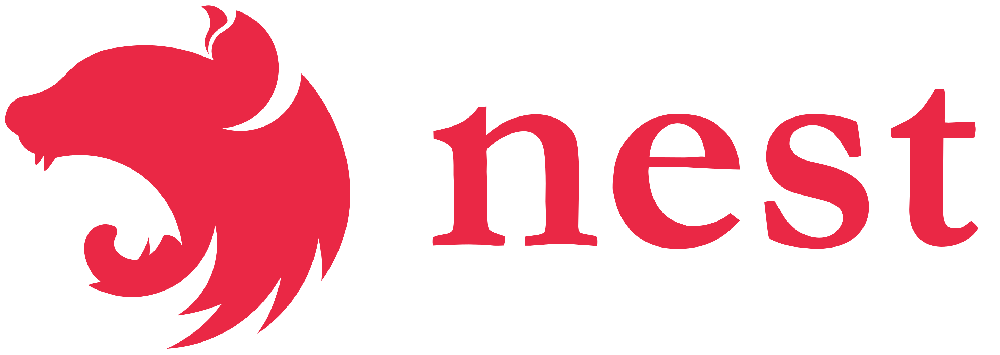

# Nestjs & Supertokens POC

## Reference:
- https://supertokens.com/docs/thirdparty/pre-built-ui/setup/core/with-docker
- https://supertokens.com/docs/thirdparty/nestjs/guide

## Technologies & IDE

   &nbsp;
   &nbsp;
   &nbsp;
   &nbsp;
  

